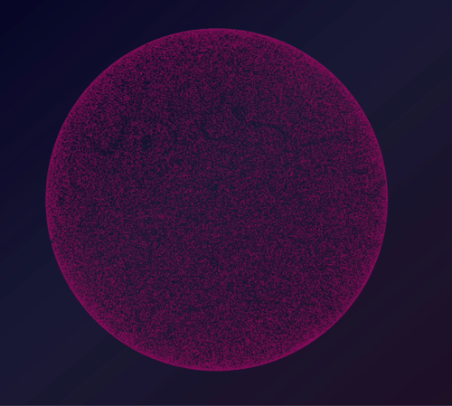

# spheres

Repository for simulating flow fields on a sphere surface.

## Development

- Run `npm i` to install all dependencies
- Tweak [`src/index.ts`](src/index.ts) to get your desired render
- Run `npm run start` to run the app

## Linting

This project uses ESLint and Prettier
